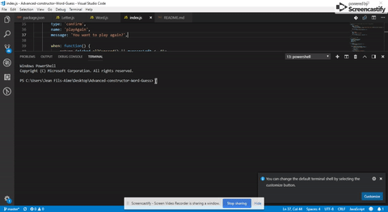

# Advanced-constructor-Word-Guess
Advanced Constructor Word Guess

# Task 
To create the Word Guess Game using Node.js. By using three files Letter.js, Word.js and index.js to make the game. on the command-line a random word will display on the placeholder and prompt the user to guess a letter, if the letter is correct display the letter on the placeholder. if incorrect, reduce the number of the incorrect guesses remaining by 1 and display the lettetr as letter that was already choose.

# Demo 

    []

# Concepts and Technologies 

- Node.js, Command line application
- NPM => Package.JSON
- inquirer (Prompt)
- ARRAY 
- For Loop
- IF statement 
- Array.forEach 